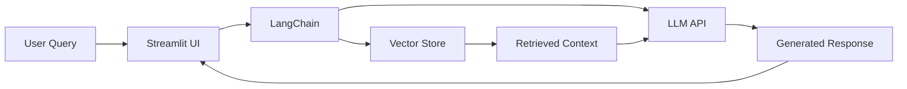

<div align="center">
  
</div>

<div align="center">
  
  
  
  
  
  

  <p><strong>Brief one-line description of what this project does</strong></p>

</div>

---

## 📋 Table of Contents

- [✨ Features](#-features)
- [🎬 Demo](#-demo)
- [🏗️ Architecture](#️-architecture)
- [🚀 Quick Start](#-quick-start)
- [📖 Usage](#-usage)
- [🔧 Configuration](#-configuration)
- [📁 Project Structure](#-project-structure)
- [🤝 Contributing](#-contributing)
- [📄 License](#-license)

---

## ✨ Features

- 🤖 **Feature 1** - Description of feature
- 📊 **Feature 2** - Description of feature
- 🔍 **Feature 3** - Description of feature
- ⚡ **Feature 4** - Description of feature

---

## 🎬 Demo

<!-- Add GIF or screenshot here -->
<div align="center">
  
</div>

<!-- Or for live demo -->
<div align="center">
  
  [](YOUR_DEMO_LINK)
  
</div>

---

## 🏗️ Architecture



---

## 🚀 Quick Start

### Prerequisites

- Python 3.11+
- OpenAI API Key (or other LLM provider)

### Installation

1. **Clone the repository**
   ```bash
   git clone https://github.com/AhmedGaballah28/PROJECT_NAME.git
   cd PROJECT_NAME
   ```

2. **Create virtual environment**
   ```bash
   python -m venv venv
   source venv/bin/activate  # On Windows: venv\Scripts\activate
   ```

3. **Install dependencies**
   ```bash
   pip install -r requirements.txt
   ```

4. **Set up environment variables**
   ```bash
   cp .env.example .env
   # Edit .env with your API keys
   ```

5. **Run the application**
   ```bash
   streamlit run app.py
   ```

---

## 📖 Usage

### Basic Example

```python
from project_name import YourClass

# Initialize
client = YourClass(api_key="your-key")

# Use the feature
result = client.process("your input")
print(result)
```

### Advanced Usage

```python
# More complex example here
```

---

## 🔧 Configuration

| Parameter | Description | Default |
|-----------|-------------|---------|
| `API_KEY` | Your OpenAI API key | Required |
| `MODEL` | LLM model to use | `gpt-3.5-turbo` |
| `TEMPERATURE` | Response creativity | `0.7` |

---

## 📁 Project Structure

```
PROJECT_NAME/
├── 📂 src/
│   ├── 📄 main.py
│   ├── 📄 chains.py
│   └── 📄 utils.py
├── 📂 data/
│   └── 📄 sample_data.json
├── 📂 tests/
│   └── 📄 test_main.py
├── 📄 app.py
├── 📄 requirements.txt
├── 📄 .env.example
└── 📄 README.md
```

---

## 🛠️ Tech Stack

<div align="center">

| Category | Technologies |
|----------|-------------|
| **Language** |  |
| **AI/ML** |   |
| **Vector DB** |  |
| **Frontend** |  |

</div>

---

## 🤝 Contributing

Contributions are welcome! Please feel free to submit a Pull Request.

1. Fork the repository
2. Create your feature branch (`git checkout -b feature/AmazingFeature`)
3. Commit your changes (`git commit -m 'Add some AmazingFeature'`)
4. Push to the branch (`git push origin feature/AmazingFeature`)
5. Open a Pull Request

---

## 📄 License

This project is licensed under the MIT License - see the [LICENSE](LICENSE) file for details.

---

<div align="center">
  
  **⭐ Star this repo if you find it helpful! ⭐**
  
  Made with ❤️ by [Ahmed Hisham](https://github.com/AhmedGaballah28)
  
</div>

<div align="center">
  
</div>
